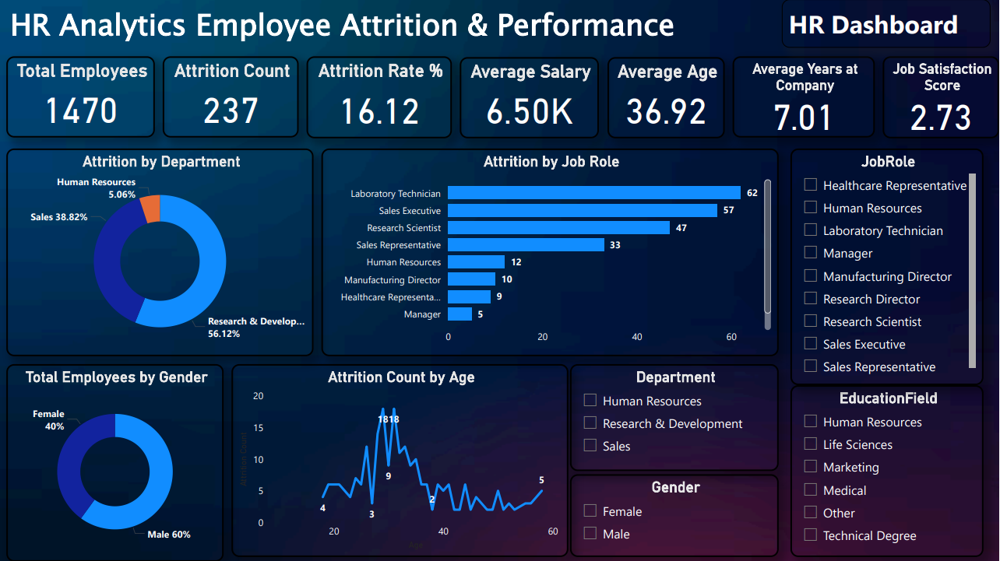
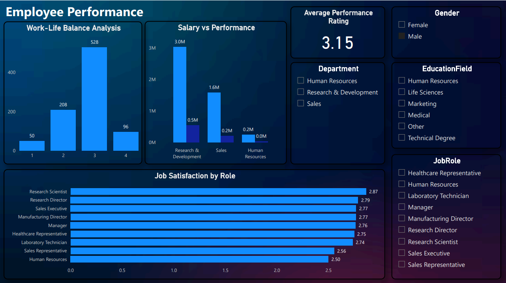
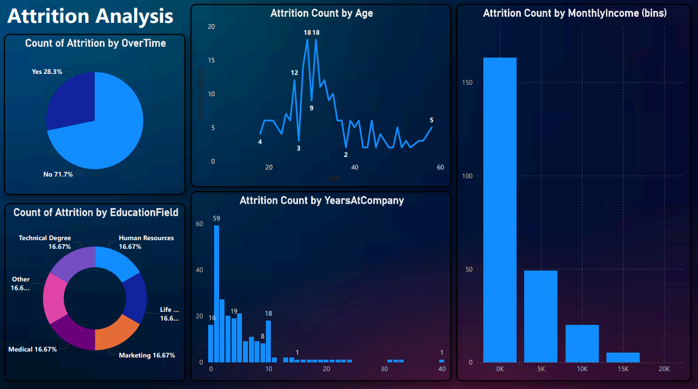

# HR-Analytics-Employee-Attrition-Performance-Dashboard
# 📊 HR Analytics Employee Attrition & Performance Dashboard

An interactive **3-page HR Analytics dashboard** built using **Microsoft Power BI, DAX, Power Query, and Data Modeling** to analyze employee attrition, performance, compensation, job satisfaction, work-life balance, and workforce demographics.

## 🎯 Project Objectives

- Analyze employee attrition and retention patterns.
- Identify departments and job roles with high attrition.
- Analyze employee performance and job satisfaction.
- Understand salary and performance relationships.
- Analyze attrition by age, income, overtime, education, and tenure.
- Provide interactive HR insights through Power BI.

## 🛠️ Tools & Technologies

- Power BI Desktop
- DAX
- Power Query
- Data Modeling
- Excel
- Data Visualization

## 📂 Dataset

The project analyzes **1,470 employee records** across **25+ workforce attributes**.

Key fields include:

- Employee ID
- Age
- Gender
- Department
- Job Role
- Education Field
- Monthly Income
- Years at Company
- Job Satisfaction
- Performance Rating
- Work-Life Balance
- OverTime
- Attrition

## 📊 Dashboard Pages

### 1. HR Dashboard

Provides an overall workforce and attrition overview.

**Key KPIs:**

- Total Employees: **1,470**
- Attrition Count: **237**
- Attrition Rate: **16.12%**
- Average Salary: **6.50K**
- Average Age: **36.92**
- Average Years at Company: **7.01**
- Job Satisfaction Score: **2.73**

**Visuals:**

- Attrition by Department
- Attrition by Job Role
- Attrition Count by Age
- Total Employees by Gender
- Department, Gender, Education Field, and Job Role slicers

### 2. Employee Performance

Analyzes employee performance, salary, work-life balance, and job satisfaction.

**Key KPI:**

- Average Performance Rating: **3.15**

**Visuals:**

- Work-Life Balance Analysis
- Salary vs Performance
- Job Satisfaction by Role
- Department, Gender, Education Field, and Job Role slicers

### 3. Attrition Analysis

Provides deeper analysis of employee attrition.

**Visuals:**

- Attrition Count by Age
- Attrition Count by Monthly Income
- Attrition Count by Years at Company
- Attrition by Education Field
- Attrition by OverTime

## 🔍 Key Insights

- **237 employees** exited the organization.
- Overall attrition rate is **16.12%**.
- **Research & Development** contributed **56.12%** of attrition.
- **Laboratory Technicians** recorded the highest attrition count at **62 employees**.
- Sales contributed **38.82%** of attrition.
- Male employees represent **60%** of the workforce, while female employees represent **40%**.
- Overtime-related attrition accounts for **28.3%** of attrition cases.
- The average performance rating is **3.15**.
- Research Scientists have the highest job satisfaction score among the listed roles at **2.87**.

## 📈 DAX Measures

```DAX
Total Employees =
COUNTROWS('HR Data')

Attrition Count =
CALCULATE(
    COUNTROWS('HR Data'),
    'HR Data'[Attrition] = "Yes"
)

Attrition Rate =
DIVIDE(
    [Attrition Count],
    [Total Employees],
    0
) * 100

Average Salary =
AVERAGE('HR Data'[MonthlyIncome])

Average Age =
AVERAGE('HR Data'[Age])

Average Years at Company =
AVERAGE('HR Data'[YearsAtCompany])

Average Job Satisfaction =
AVERAGE('HR Data'[JobSatisfaction])

Average Performance Rating =
AVERAGE('HR Data'[PerformanceRating])

Overtime Attrition Count =
CALCULATE(
    [Attrition Count],
    'HR Data'[OverTime] = "Yes"
)

Female Employees =
CALCULATE(
    [Total Employees],
    'HR Data'[Gender] = "Female"
)

Male Employees =
CALCULATE(
    [Total Employees],
    'HR Data'[Gender] = "Male"
)
```

> **Note:** If the table name in your Power BI model is different from `HR Data`, replace `HR Data` with the exact table name used in the model.

## 📸 Dashboard Screenshots

### 🏠 HR Dashboard



### 📊 Employee Performance



### 📈 Attrition Analysis



## 📁 Project Structure

```text
HR-Analytics-Employee-Attrition-PowerBI/
│
├── HR_Analytics_Employee_Attrition_Performance.pbit
├── HR_Analytics_Cleaned_Dataset.xlsx
├── HR_Analytics_Dashboard_Report.pdf
├── README.md
│
└── Screenshots/
    ├── HR_Dashboard.png
    ├── Employee_Performance.png
    └── Attrition_Analysis.png
```

## 🚀 How to Use

1. Download or clone this repository.
2. Open the `.pbit` file using Power BI Desktop.
3. If Power BI asks for the data source, select the included Excel dataset.
4. Refresh the data if required.
5. Navigate through the three dashboard pages.
6. Use the slicers to explore the HR analysis interactively.

## 💼 Business Value

This dashboard can help HR teams:

- Monitor employee attrition.
- Identify high-risk departments and job roles.
- Understand employee satisfaction.
- Analyze compensation and performance.
- Evaluate overtime and work-life balance.
- Support data-driven employee retention strategies.
